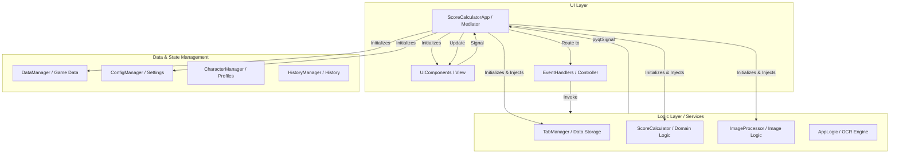

# アプリケーション処理フローと改善点分析

## 1. 処理フロー図 (Architecture & Data Flow)

## 2. 詳細プロセスフロー

1.  **起動フェーズ**:
    *   `wuwacalc17.py` がエントリーポイント（Mediator）として機能。
    *   依存関係の順序（Data -> UI実体化 -> Logic Manager -> Signals）を厳守して初期化。
    *   `UIComponents` が全ウィジェットを即座に実体化し、`None` 参照を防止。
2.  **画像処理・OCRフェーズ**:
    *   `ScoreCalculatorApp` がファイル選択 UI を担当。
    *   `ImageProcessor` がクロップと OCR 命令を管理（UI 非依存）。
    *   `AppLogic` が Tesseract テキスト解析と正規化（エイリアス対応）を実行。
3.  **スコア計算フェーズ**:
    *   `ScoreCalculator` が注入されたマネージャーを使用して純粋な計算ロジックを実行。
    *   キャラ未選択時は `waiting_for_character` 状態となり、ユーザー入力を待機。

## 3. 現状分析

*   **アーキテクチャ**: 疎結合なメディエーターパターンへの移行が完了。
*   **コンポーネント独立性**: `ScoreCalculator`, `TabManager`, `ImageProcessor` が GUI なしでテスト可能な状態になった。
*   **堅牢性**: 初期化順序の整理と属性の事前宣言により、起動時の `AttributeError` や `NameError` が解消。

## 4. 完了済みの主要タスク (2025/12/25)

*   **UI とロジックの完全分離**:
    *   ロジック層クラス（`Calc`, `TabM`, `ImgProc`）から `self.app` への直接参照を全廃。
    *   UI 操作を `ScoreCalculatorApp` 側のシグナルハンドラーに集約。
    *   UI コンポーネントからのロジック参照をラッパーメソッド経由に一本化。
*   **UI 構造の刷新**:
    *   `SettingsPanel` の委譲を廃止し `UIComponents` に統合。属性アクセスの不整合を解消。
    *   「基本設定」枠のレイアウト修正（ボタンや計算方式を枠内に収容）。
    *   キャラクター選択ボックスの検索機能（部分一致）を有効化。
*   **OCR・計算精度の向上**:
    *   有効ステータスカウント時の浮動小数点誤差（`eps`）対応。
    *   ダメージアップ系・共鳴効率のエイリアス拡充。
    *   OCR テキストからのノイズ記号除去。
*   **表示設定ボタンの復元**:
    - `ui_components.py` に欠落していた「表示設定」ボタンを再実装。
    - `wuwacalc17.py` に `DisplaySettingsDialog` が要求する委譲メソッド群（`update_text_color`, `apply_theme`等）を実装し、テーマ変更機能の完全な復旧。
*   **各種ダイアログボタンの追加**:
    - 「履歴 (History)」「前処理設定 (Preprocessing)」ボタンを `ui_components.py` に追加。
    - `wuwacalc17.py` にそれぞれのダイアログを開くメソッドを追加。
*   **OCR判別精度の向上**:
    - 実数値(Flat)とパーセント(%)の誤認を防ぐバリデーションロジックを `app_logic.py` に追加。攻撃力等が20未満で小数点を含む場合は自動的に「%」として扱う。
*   **出力フォーマットの修正**:
    - `html_renderer.py` にて `self.tr` への引数渡しが漏れていた箇所を修正し、`{}` プレースホルダが残る問題を解消。
*   **起動待機ロジック**:
    *   キャラ未選択時の計算保留と、選択後の自動実行フローを実装。

## 5. 現在の課題とネクストアクション

*   **コードの重複整理**: `ScoreCalculatorApp` に追加した多くのラッパーメソッドを、より洗練されたイベントバスやコントローラー構造に整理する余地がある。
*   **バッチ処理のUIフィードバック**: バッチ処理中の進捗表示をよりグラフィカルにする（現在はログ出力のみ）。
*   **エラーガイダンスの強化**: Tesseract がインストールされていない場合などのエラーメッセージをよりユーザーフレンドリーにする。